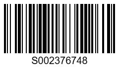
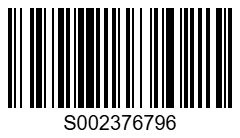

# Mini Cycle Count Web App — Storyboard & Workflow

*A detailed page-by-page walkthrough of the user interface*

---

## Design Specifications

| Element | Specification |
|---------|---------------|
| **Target Device** | Desktop or larger tablet (iPad Pro, Surface, etc.) |
| **Screen Size** | 1024px+ width, responsive down to 768px |
| **Layout** | Single-column content area, max-width 900px, centered |
| **Background** | Off-white (#F8FAFC) |
| **Cards** | White (#FFFFFF), subtle shadow (0 4px 6px -1px rgba(0,0,0,0.1)), rounded corners (12px) |
| **Typography** | Headers: Inter 600, 28px; Body: Inter 400, 16px; Monospace: JetBrains Mono 14px |
| **Primary Color** | Deep Blue (#1E40AF) — buttons, links |
| **Secondary Color** | Slate (#475569) — supporting text |
| **Spacing** | 32px between sections, 24px inside cards |
| **Navigation** | Bottom-fixed progress bar with "Continue" button |
| **Transitions** | Fade-in on page load (300ms ease) |

---

## Page 1: Welcome & Explanation

### Purpose
Introduce the tool and explain the value of partial cycle counts.

### Layout

```
┌──────────────────────────────────────────────────────────────────┐
│                                                                  │
│                    🏪 MINI CYCLE COUNT TOOL                      │
│                                                                  │
│    A lightweight alternative to full physical inventory counts   │
│                                                                  │
├──────────────────────────────────────────────────────────────────┤
│                                                                  │
│  ┌──────────────────────────────────────────────────────────┐   │
│  │  WHY PARTIAL COUNTS?                                      │   │
│  │                                                           │   │
│  │  • Full physical counts cost $2,000–$5,000+               │   │
│  │  • Require all hands on deck for a full day               │   │
│  │  • Partial counts let you scan one category, date range,  │   │
│  │    or zone at a time — fit it into normal operations      │   │
│  │  • Run them monthly, quarterly, or before clearance       │   │
│  │    events to catch drift early                            │   │
│  │                                                           │   │
│  │  This tool walks you through:                             │   │
│  │    1. Upload your inventory file                          │   │
│  │    2. Scan items on the floor/warehouse                   │   │
│  │    3. Review and approve write-offs                       │   │
│  │    4. Export ready-to-use files for DRS                   │   │
│  │                                                           │   │
│  └──────────────────────────────────────────────────────────┘   │
│                                                                  │
│                     [  GET STARTED  →  ]                         │
│                                                                  │
│                     <a href="#faq">Visit FAQ</a>                 │
│                                                                  │
└──────────────────────────────────────────────────────────────────┘
```

### Elements
- **Header:** App name + icon
- **Hero card:** Explanation text, bullet points, visual icons for each step
- **Primary CTA:** Large blue button "Get Started"
- **Secondary link:** "Visit FAQ" in footer area

---

## Page 2: Prepare Your Files

### Purpose
Instruct user on what DRS reports to download and upload, with date range guidance.

### Layout

```
┌──────────────────────────────────────────────────────────────────┐
│  ← Back    Step 1 of 5: Prepare Your Files                      │
├──────────────────────────────────────────────────────────────────┤
│                                                                  │
│  ┌──────────────────────────────────────────────────────────┐   │
│  │  WHAT YOU NEED TO UPLOAD                                  │   │
│  │                                                           │   │
│  │  1. Item Buy Detail (or Item Detail Report)               │   │
│  │     → Shows every item in DRS with buy date, cost, retail │   │
│  │                                                           │   │
│  │  2. (Optional) Inventory Adjustments                      │   │
│  │     → If you want to see write-off history                │   │
│  │                                                           │   │
│  │  WHERE TO FIND THESE REPORTS                              │   │
│  │  ──────────────────────────────────────────────────────   │   │
│  │  DRS → Reports → Inventory Reports → Item Buy Detail      │   │
│  │                                                           │   │
│  │  Export as: CSV or Excel (.xlsx)                          │   │
│  │                                                           │   │
│  └──────────────────────────────────────────────────────────┘   │
│                                                                  │
│  ┌──────────────────────────────────────────────────────────┐   │
│  │  DATE RANGE GUIDANCE                                      │   │
│  │                                                           │   │
│  │  • For a typical partial count, use a 3–6 month window    │   │
│  │  • Large stores (>50 bins) may need to split into         │   │
│  │    multiple date ranges                                   │   │
│  │  • Example: "Items bought Jan 1 – Jun 30, 2026"          │   │
│  │  • Rule of thumb: <10,000 rows per file for smooth        │   │
│  │    processing                                             │   │
│  │                                                           │   │
│  │  💡 Pro tip: Start with your oldest unsold items —        │   │
│  │     they're most likely to show up as missing             │   │
│  │                                                           │   │
│  └──────────────────────────────────────────────────────────┘   │
│                                                                  │
│  ┌──────────────────────────────────────────────────────────┐   │
│  │  UPLOAD YOUR FILE                                         │   │
│  │                                                           │   │
│  │         ┌─────────────────────────────────────┐           │   │
│  │         │                                     │           │   │
│  │         │    📁 Drag & drop your file         │           │   │
│  │         │        or click to browse           │           │   │
│  │         │                                     │           │   │
│  │         │    Supported: .csv, .xlsx           │           │   │
│  │         │                                     │           │   │
│  │         └─────────────────────────────────────┘           │   │
│  │                                                           │   │
│  │         [  Cancel  ]           [  Upload File  ]          │   │
│  │                                                           │   │
│  │  ──────────────────────────────────────────────────────   │   │
│  │  Don't have the file? <a href="#email-instructions">      │   │
│  │  Email it to your assistant →</a>                         │   │
│  └──────────────────────────────────────────────────────────┘   │
│                                                                  │
│                     [  ← Back  ]     [  Continue  →  ]          │
│                                                                  │
└──────────────────────────────────────────────────────────────────┘
```

### Elements
- **Progress indicator:** "Step 1 of 5" with visual stepper
- **Two info cards:** "What you need" + "Date range guidance"
- **File upload zone:** Drag-and-drop area with clear affordance
- **Link:** "Email it to your assistant" (opens modal with instructions)
- **Navigation:** Back + Continue buttons fixed at bottom

---

## Page 3: Conduct the Scan

### Purpose
Provide hardware setup instructions and guide user through scanning process.

### Layout

```
┌──────────────────────────────────────────────────────────────────┐
│  ← Back    Step 2 of 5: Conduct the Scan                        │
├──────────────────────────────────────────────────────────────────┤
│                                                                  │
│  ┌──────────────────────────────────────────────────────────┐   │
│  │  WHAT YOU'LL NEED                                          │   │
│  │                                                           │   │
│  │  Option A: Laptop + USB Barcode Scanner                    │   │
│  │  ──────────────────────────────────────────────────────   │   │
│  │  • Laptop with a wide USB port                             │   │
│  │  • USB barcode scanner (most common ($30–$80))            │   │
│  │  • Plug in, open this page in a browser, click in the     │   │
│  │    scan field below                                        │   │
│  │                                                           │   │
│  │  Option B: Tablet + Bluetooth Scanner                      │   │
│  │  ──────────────────────────────────────────────────────   │   │
│  │  • Tablet (iPad, Surface, Android)                         │   │
│  │  • Bluetooth scanner paired to tablet                     │   │
│  │  • Same process — tap the field, start scanning           │   │
│  │                                                           │   │
│  │  SCANNING TIPS                                             │   │
│  │  ──────────────────────────────────────────────────────   │   │
│  │  • Scan each item once — duplicate beeps = already counted │   │
│  │  • Duplicate detection shows: DUPLICATE (red),            │   │
│  │    NEARBY (amber, within 5 scans), REPEAT CHUNK (orange,  │   │
│  │    same 8 items twice)                                     │   │
│  │  • Move systematically through the aisle/bin              │   │
│  │  • Keep the scanner beam perpendicular to the barcode     │   │
│  │  • For items without barcodes, you can skip or manually   │   │
│  │    enter the SKU                                           │   │
│  │                                                           │   │
│  └──────────────────────────────────────────────────────────┘   │
│                                                                  │
│  ┌──────────────────────────────────────────────────────────┐   │
│  │  SCAN NOW                                                  │   │
│  │                                                           │   │
│  │    🔍 Scan field (click here and start scanning)          │   │
│  │    ─────────────────────────────────────────────────────   │   │
│  │                                                           │   │
│  │    Items scanned this session: 0                          │   │
│  │                                                           │   │
│  │    Recent scans:                                           │   │
│  │    ┌─────────────────────────────────────────────────┐    │   │
│  │    │ (no items scanned yet)                           │    │   │
│  │    └─────────────────────────────────────────────────┘    │   │
│  │                                                           │   │
│  │    [  Clear All  ]                                         │   │
│  │                                                           │   │
│  └──────────────────────────────────────────────────────────┘   │
│                                                                  │
│  ┌──────────────────────────────────────────────────────────┐   │
│  │  ALTERNATIVE: UPLOAD A SCAN FILE                           │   │
│  │  If you used a dedicated inventory scanner 
   |  you can upload that CSV file instead.                    │
│  │                                                           │   │
│  │         [  Upload Scan File  ]                            │   │
│  │                                                           │   │
│  └──────────────────────────────────────────────────────────┘   │
│                                                                  │
│                     [  ← Back  ]     [  Continue  →  ]          │
│                                                                  │
└──────────────────────────────────────────────────────────────────┘
```

### Elements
- **Hardware setup cards:** Two options with icons
- **Scan input field:** Large, prominent, auto-focused
- **Running count display:** Updates in real-time
- **Recent scans list:** Scrollable, shows last 10 items
- **Alternative path:** "Upload Scan File" button for Datascan users
- **Navigation:** Back + Continue (disabled until >=1 item scanned)

---

## Page 4: Processing (Background)

### Purpose
Manage user expectations while the app processes uploaded files.

### Layout

```
┌──────────────────────────────────────────────────────────────────┐
│       Step 3 of 5: Processing Your Files                        │
├──────────────────────────────────────────────────────────────────┤
│                                                                  │
│                    ┌─────────────────────┐                      │
│                    │                     │                      │
│                    │      ⏳              │                      │
│                    │                     │                      │
│                    │   Processing...     │                      │
│                    │                     │                      │
│                    └─────────────────────┘                      │
│                                                                  │
│  ┌──────────────────────────────────────────────────────────┐   │
│  │  WHAT'S HAPPENING IN THE BACKGROUND                       │   │
│  │                                                           │   │
│  │  1. Parsing your inventory file (~X,XXX items)           │   │
│  │  2. Matching scanned items against the inventory list    │   │
│  │  3. Identifying items that are in DRS but not scanned    │   │
│  │  4. Flagging items that were scanned but aren't in DRS   │   │
│  │  5. Building a working dataset for review                │   │
│  │                                                           │   │
│  │  This usually takes 30 seconds to 2 minutes depending    │   │
│  │  on file size. Please don't close this page.             │   │
│  │                                                           │   │
│  └──────────────────────────────────────────────────────────┘   │
│                                                                  │
│                     [  Cancel  ]                                │
│                                                                  │
└──────────────────────────────────────────────────────────────────┘
```

### Elements
- **Spinner/loading animation:** Centered, subtle
- **Step-by-step list:** Shows current processing stage
- **Cancel button:** Allows abort if file wrong
- **No navigation buttons:** User waits until complete

---

## Page 5: Review Missing Items

### Purpose
Show likely missing items, allow user to approve or reject each for write-off.

### Layout

```
┌──────────────────────────────────────────────────────────────────┐
│  ← Back    Step 4 of 5: Review Items (47 of 203)                │
├──────────────────────────────────────────────────────────────────┤
│                                                                  │
│  ┌──────────────────────────────────────────────────────────┐   │
│  │  SUMMARY                                                  │   │
│  │  ────────────────────────────────────────────────────────│   │
│  │  Total items in file:    2,847                           │   │
│  │  Items scanned:           2,394                           │   │
│  │  Items NOT scanned:      453  ← you're reviewing these   │   │
│  │                                                           │   │
│  │  Showing: Items NOT scanned (most likely missing)        │   │
│  │  [Show scanned items] [Show unscanned + not in file]     │   │
│  └──────────────────────────────────────────────────────────┘   │
│                                                                  │
│  ┌──────────────────────────────────────────────────────────┐   │
│  │  ITEM #1          Buy Date: 2024-12-30                    │   │
│  │  ────────────────────────────────────────────────────────│   │
│  │  SKU: SK892034                                           │   │
│  │  Description: Dunk High/Nike                            │   │
│  │  Size: 10    |   Cost: $4.00   |   Retail: $14.00        │   │
│  │  Category: Shoes                                          │   │
│  │                                                           │   │
│  │  ────────────────────────────────────────────────────────│   │
│  │  STATUS: MISSING (in file, not scanned)                  │   │
│  │                                                           │   │
│  │              [ ✓ ACCEPT WRITE-OFF ]   [ ✗ SKIP ]         │   │
│  │                                                           │   │
│  └──────────────────────────────────────────────────────────┘   │
│                                                                  │
│  ┌──────────────────────────────────────────────────────────┐   │
│  │  ITEM #2          Buy Date: 2025-01-15                   │   │
│  │  Description: WT Tank/lululemon  |  Size: M  |  Cost: $6 │   │
│  │  ...                                                       │   │
│  └──────────────────────────────────────────────────────────┘   │
│                                                                  │
│  ┌──────────────────────────────────────────────────────────┐   │
│  │  BATCH ACTIONS (optional)                                 │   │
│  │  ────────────────────────────────────────────────────────│   │
│  │  [Accept All Remaining]  [Skip All Remaining]             │   │
│  │  Filter by: Cost < $5  |  Retail < $20  |  Category: ___  │   │
│  └──────────────────────────────────────────────────────────┘   │
│                                                                  │
│                     [  ← Back  ]     [  Continue  →  ]          │
│                                                                  │
└──────────────────────────────────────────────────────────────────┘
```

### Elements
- **Summary card:** Top-level stats, toggle views
- **Item cards:** One at a time in viewport, scrollable
  - SKU, Description (concatenated with Brand), Size, Cost, Retail, Buy Date
  - Status badge (MISSING, NOT IN FILE, etc.)
  - Large action buttons: Accept Write-Off (green), Skip (gray)
- **Buy Date handling:** Converts Excel serial dates (e.g., 45505 → 2024-12-30)
- **Description format:** Shows "Description/Brand" (e.g., "WT Tank/lululemon")
- **Keyboard shortcuts:** Right arrow = accept, Left arrow = skip, Down = next
- **Batch actions:** For power users, with filter dropdowns
- **Progress bar:** "47 of 203" — shows position in queue
- **Navigation:** Back + Continue (enabled after all items reviewed or batch action taken)

---

## Page 6: Export & Deliver

### Purpose
Allow user to download or email the final write-off list.

### Layout

```
┌──────────────────────────────────────────────────────────────────┐
│  ← Back    Step 5 of 5: Export Results                          │
├──────────────────────────────────────────────────────────────────┤
│                                                                  │
│  ┌──────────────────────────────────────────────────────────┐   │
│  │  REVIEW SUMMARY                                           │   │
│  │  ────────────────────────────────────────────────────────│   │
│  │  Items scanned:             2,394                        │   │
│  │  Accepted for write-off:     312                         │   │
│  │    → Total cost value:      $1,248.00                    │   │
│  │  Skipped:                    141                         │   │
│  │                                                           │   │
│  └──────────────────────────────────────────────────────────┘   │
│                                                                  │
│  ┌──────────────────────────────────────────────────────────┐   │
│  │  DOWNLOAD OPTIONS                                         │   │
│  │                                                           │   │
│  │  📄 Write-Off List (DRS-ready)                           │   │
│  │     → adjustments_YYYY-MM-DD.csv                         │   │
│  │     → Ready for manual adjust in DRS                     │   │
│  │                                                           │   │
│  │  🖨️ Barcode Sheet                                        │   │
│  │     → barcodes_YYYY-MM-DD.csv                            │   │
│  │     → For printing scan sheets                           │   │
│  │                                                           │   │
│  │  📋 Combined Report                                       │   │
│  │     → Full report with all columns                       │   │
│  │                                                           │   │
│  │              [  Download All Files  ]                    │   │
│  │                                                           │   │
│  └──────────────────────────────────────────────────────────┘   │
│                                                                  │
│  ┌──────────────────────────────────────────────────────────┐   │
│  │  📋 DUPLICATE SCAN LOG                                     │   │
│  │  ────────────────────────────────────────────────────────│   │
│  │  Records of items scanned that match previous scans       │   │
│  │  Threshold: Nearby duplicates within 5 items,            │   │
│  │  repeated chunks of 8 items                              │   │
│  │                                                           │   │
│  │  ┌─────────────────────────────────────────────────────┐  │   │
│  │  │ Count │ Type              │ Example               │  │   │
│  │  │  0    │  Repeated Chunks  │ Pos 45→53             │  │   │
│  │  │  0    │  Nearby Duplicates│ Pos 12→Pos 89 (Zone)  │  │   │
│  │  │ 12    │  Exact Duplicates │ Pos 5→Pos 67 (Endcap) │  │   │
│  │  └─────────────────────────────────────────────────────┘  │   │
│  │                                                           │   │
│  │  CSV columns: SKU, Scan Position, Other Position, Zone,  │   │
│  │              Issue Type, Notes                           │   │
│  │                                                           │   │
│  │     [  Download Duplicate Scan Log  ]                   │   │
│  │                                                           │   │
│  └──────────────────────────────────────────────────────────┘   │
│                                                                  │
│  ┌──────────────────────────────────────────────────────────┐   │
│  │  📈 2 OH WRITE-UP CANDIDATES                              │   │
│  │  ────────────────────────────────────────────────────────│   │
│  │  Items with exactly 2 on-hand that may need              │   │
│  │  inventory written up                                    │   │
│  │                                                           │   │
│  │     [  View 2 OH Items  ]    [  Download 2 OH List  ]   │   │
│  │                                                           │   │
│  └──────────────────────────────────────────────────────────┘   │
│                                                                  │
│  ┌──────────────────────────────────────────────────────────┐   │
│  │  EMAIL TO ME                                              │   │
│  │  ────────────────────────────────────────────────────────│   │
│  │  📧 Send to: [your@email.com]                            │   │
│  │  Subject: Cycle Count Results – [Store] – [Date]         │   │
│  │                                                           │   │
│  │     [  Email Me These Files  ]                           │   │
│  │                                                           │   │
│  │  (Or download and attach manually)                       │   │
│  │                                                           │   │
│  └──────────────────────────────────────────────────────────┘   │
│                                                                  │
│                     [  ← Back  ]     [  Finish  ]               │
│                                                                  │
└──────────────────────────────────────────────────────────────────┘
```

### Elements
- **Summary table:** Final counts and values
- **Download cards:** Three file types with icons
- **Email form:** Pre-filled address, editable subject
- **Action buttons:** Large, primary action prominent
- **Navigation:** Back + Finish

### Barcode ZIP Processing
- **Input:** ZIP file from barcodegenerator.tech (Code 128, PNG files)
- **Process:** 
  1. User uploads ZIP
  2. App unzips using JSZip
  3. Creates 5×22 grid layouts (5 columns, 22 rows per page)
  4. Generates printable PDF/HTML
- **Output:** Print-ready barcode sheets

---

## Barcode Sheet Generation Process (Manual)

**When you need to generate printable barcode sheets for scanning:**

### Step 1: Generate Barcode Images
1. Go to [barcodegenerator.tech](https://barcodegenerator.tech)
2. Select "Code 128" as the barcode type
3. Enter the SKUs (one per line) from your inventory file
4. Set options: Width 2, Height 50, no text display
5. Generate and download as ZIP containing PNG images

### Step 2: Arrange Images into Grid
1. Place PNG images in `/barcodes/` folder (numbered sequentially)
2. Create HTML with 5-column × 22-row grid:
   ```html
   <div class="page">
     <div class="barcode"></div>
     <div class="barcode"></div>
     <!-- ... repeat for all images -->
   </div>
   ```

### Step 3: Convert to PDF
```bash
wkhtmltopdf --page-size Letter \
  --margin-top 0.25in --margin-bottom 0.25in \
  --margin-left 0.25in --margin-right 0.25in \
  --enable-local-file-access \
  shorts-barcodes-printable.html shorts-barcodes-printable.pdf
```

**Rules:**
- 110 barcodes per page (5×22 grid)
- Fewer barcodes = partial page
- More than 110 = multiple pages

---

## Page 6b: Additional Processing (Optional)

### Purpose
Offer further refinement of the write-off list before final DRS entry.

### Layout (appears after user clicks "Continue" from Export)

```
┌──────────────────────────────────────────────────────────────────┐
│       Additional Processing                                     │
├──────────────────────────────────────────────────────────────────┤
│                                                                  │
│  ┌──────────────────────────────────────────────────────────┐   │
│  │  DO YOU WANT TO GO FURTHER?                              │   │
│  │                                                           │   │
│  │  Your basic write-off list is ready. I can also:         │   │
│  │                                                           │   │
│  │  • Deduplicate SKUs (combine qty for same SKU)           │   │
│  │  • Add reason codes (C-Cycl, S-Loss, etc.)               │   │
│  │  • Group by category for organized DRS entry             │   │
│  │  • Generate a printable barcode sheet for scanning       │   │
│  │    items off the floor                                   │   │
│  │                                                           │   │
│  │  This takes another 1–2 minutes.                         │   │
│  │                                                           │   │
│  │              [  No Thanks — Use Current List  ]          │   │
│  │                              [  Continue Processing  ]   │   │
│  │                                                           │   │
│  └──────────────────────────────────────────────────────────┘   │
│                                                                  │
└──────────────────────────────────────────────────────────────────┘
```

### Elements
- **Choice card:** Two large buttons
- **Option 1:** Stop here, use current list
- **Option 2:** Continue for enriched version

---

## Page 7: DRS Entry Instructions

### Purpose
Guide user through applying write-offs in the DRS system.

### Layout

```
┌──────────────────────────────────────────────────────────────────┐
│       Final Step: Enter into DRS                                 │
├──────────────────────────────────────────────────────────────────┤
│                                                                  │
│  ┌──────────────────────────────────────────────────────────┐   │
│  │  HOW TO ENTER WRITE-OFFS IN DRS                          │   │
│  │                                                           │   │
│  │  Option A: Manual Entry (for small lists)                │   │
│  │  ──────────────────────────────────────────────────────   │   │
│  │  1. Go to Inventory → Adjustments → Write-Off            │   │
│  │  2. Enter SKU, Quantity, Reason Code                     │   │
│  │  3. Repeat for each item                                 │   │
│  │                                                           │   │
│  │  Option B: Import File (recommended for 50+ items)       │   │
│  │  ──────────────────────────────────────────────────────   │   │
│  │  1. Prepare your adjustments CSV                         │   │
│  │  2. Go to Inventory → Adjustments → Import               │   │
│  │  3. Upload the file we generated                         │   │
│  │  4. Verify preview, confirm                              │   │
│  │                                                           │   │
│  │  REASON CODES TO USE                                     │   │
│  │  ──────────────────────────────────────────────────────   │   │
│  │  • C-Cycl  → Cycle count (physical scan)                 │   │
│  │  • S-Loss  → Shrink (unexplained loss)                   │   │
│  │  • D-Disc → Damaged/Discarded                            │   │
│  │  • S-Misc  → Miscellaneous (use sparingly)               │   │
│  │                                                           │   │
│  │  ⚠️  Don't use T-Sell for cycle counts — it's for        │   │
│  │       items that went through clearance and didn't sell  │   │
│  │                                                           │   │
│  └──────────────────────────────────────────────────────────┘   │
│                                                                  │
│  ┌──────────────────────────────────────────────────────────┐   │
│  │  NEED HELP?                                               │   │
│  │                                                           │   │
│  │  • <a href="#faq">Visit FAQ</a>                          │   │
│  │  • Contact your assistant for troubleshooting            │   │
│  │                                                           │   │
│  └──────────────────────────────────────────────────────────┘   │
│                                                                  │
│                     [  ← Back  ]     [  Done  ]                 │
│                                                                  │
└──────────────────────────────────────────────────────────────────┘
```

### Elements
- **Two methods:** Manual entry vs. Import
- **Step-by-step lists:** Numbered for each method
- **Reason code reference table:** Clear, with descriptions
- **Warning callout:** Clear distinction on code usage
- **Help links:** FAQ and assistant contact
- **Navigation:** Back + Done (returns to home)

### Output File Format
The adjustments CSV uses columns:
- SKU, Description (with Brand concatenated), Size, Buy Date (YYYY-MM-DD), Cost, Retail, Category, Reason Code, Notes
- Zone column removed (was redundant - all items "Not Scanned")

---

## Page 8: FAQ

### Purpose
Answer common questions about the tool, process, and troubleshooting.

### Layout

```
┌──────────────────────────────────────────────────────────────────┐
│  ← Back    FAQ                                                  │
├──────────────────────────────────────────────────────────────────┤
│                                                                  │
│  ┌──────────────────────────────────────────────────────────┐   │
│  │  GENERAL                                                  │   │
│  │                                                           │   │
│  │  Q: How is this different from a full physical count?    │   │
│  │  A: A full physical count (RGIS/Datascan) scans every    │   │
│  │     item in the store. This tool lets you scan a subset  │   │
│  │     — one category, date range, or zone at a time.       │   │
│  │                                                           │   │
│  │  Q: How often should I run a partial count?              │   │
│  │  A: Monthly is ideal for high-traffic stores.            │   │
│  │     Quarterly works for lower-volume locations.          │   │
│  │     Always run before a major clearance event.           │   │
│  │                                                           │   │
│  │  Q: Can I use this if I don't have a barcode scanner?    │   │
│  │  A: Yes — you can upload a scan file from a dedicated    │   │
│  │     scanner, or manually enter SKUs one by one.          │   │
│  │                                                           │   │
│  └──────────────────────────────────────────────────────────┘   │
│                                                                  │
│  ┌──────────────────────────────────────────────────────────┐   │
│  │  FILES & DATA                                             │   │
│  │                                                           │   │
│  │  Q: My file is too large (>10,000 rows). What do I do?   │   │
│  │  A: Split your DRS export into multiple date ranges.     │   │
│  │     For example: Jan–Mar, Apr–Jun, Jul–Sep separately.   │   │
│  │                                                           │   │
│  │  Q: The tool says my file has no valid data.             │   │
│  │  A: Make sure you're uploading the Item Buy Detail,      │   │
│  │     not the Summary Report. Check that columns include   │   │
│  │     SKU, Buy Date, Cost, and Retail.                     │   │
│  │                                                           │   │
│  └──────────────────────────────────────────────────────────┘   │
│                                                                  │
│  ┌──────────────────────────────────────────────────────────┐   │
│  │  HARDWARE                                                 │   │
│  │                                                           │   │
│  │  Q: My scanner isn't working.                            │   │
│  │  A: Try clicking the scan field first. Some scanners     │   │
│  │     require the field to be focused. Also ensure no      │   │
│  │     other app has the scanner bound.                     │   │
│  │                                                           │   │
│  │  Q: Can I use a phone instead of a laptop?               │   │
│  │  A: Yes — but a laptop or tablet is recommended for      │   │
│  │     larger screens. Phones work but require more         │   │
│  │     scrolling.                                           │   │
│  │                                                           │   │
│  └──────────────────────────────────────────────────────────┘   │
│                                                                  │
│  ┌──────────────────────────────────────────────────────────┐   │
│  │  DRS & WRITE-OFFS                                         │   │
│  │                                                           │   │
│  │  Q: What happens if I enter the wrong reason code?       │   │
│  │  A: It can cause reporting issues. Use C-Cycl for        │   │
│  │     cycle counts, S-Loss for shrink. Avoid S-Misc        │   │
│  │     unless truly necessary.                              │   │
│  │                                                           │   │
│  │  Q: Can I undo a write-off in DRS?                       │   │
│  │  A: Yes — but it requires supervisor access. Contact    │   │
│  │     your DM if you've made an error.                     │   │
│  │                                                           │   │
│  └──────────────────────────────────────────────────────────┘   │
│                                                                  │
│                     [  ← Back  ]     [  Home  ]                 │
│                                                                  │
└──────────────────────────────────────────────────────────────────┘
```

### Elements
- **Sections:** Grouped by category (General, Files & Data, Hardware, DRS & Write-Offs)
- **Accordion style:** Questions collapse/expand to keep page clean
- **Navigation:** Back + Home

---

## Page 9: Security & Privacy

### Purpose
Build trust by explaining how data is handled.

### Layout

```
┌──────────────────────────────────────────────────────────────────┐
│       Security & Privacy                                        │
├──────────────────────────────────────────────────────────────────┤
│                                                                  │
│  ┌──────────────────────────────────────────────────────────┐   │
│  │  YOUR DATA STAYS LOCAL                                    │   │
│  │                                                           │   │
│  │  • All inventory files are processed in your browser     │   │
│  │  • Nothing is uploaded to an external server             │   │
│  │  • Files are stored only in your session (cleared on     │   │
│  │    close)                                                 │   │
│  │  • Email delivery is the only data that leaves the       │   │
│  │    tool — and only when you explicitly click "Send"      │   │
│  │                                                           │   │
│  └──────────────────────────────────────────────────────────┘   │
│                                                                  │
│  ┌──────────────────────────────────────────────────────────┐   │
│  │  WHAT WE DO WITH YOUR DATA                                │   │
│  │                                                           │   │
│  │  Your inventory data is used solely to:                  │   │
│  │  1. Match scanned items against your DRS inventory       │   │
│  │  2. Generate write-off lists                             │   │
│  │  3. Create barcode sheets                                │   │
│  │                                                           │   │
│  │  We do NOT:                                               │   │
│  │  • Share your data with any third party                  │   │
│  │  • Use it for analytics or benchmarking                   │   │
│  │  • Store it beyond your session                          │   │
│  │                                                           │   │
│  └──────────────────────────────────────────────────────────┘   │
│                                                                  │
│  ┌──────────────────────────────────────────────────────────┐   │
│  │  RECOMMENDATIONS                                          │   │
│  │                                                           │   │
│  │  • Use a private browser window for counts               │   │
│  │  • Close the tab when finished                           │   │
│  │  • Don't run counts on public WiFi                        │   │
│  │  • If emailing results, use your work email, not         │   │
│  │    personal accounts                                      │   │
│  │                                                           │   │
│  └──────────────────────────────────────────────────────────┘   │
│                                                                  │
│                     [  ← Back  ]     [  Home  ]                 │
│                                                                  │
└──────────────────────────────────────────────────────────────────┘
```

### Elements
- **Three info cards:** What stays local, What we do, Recommendations
- **Clear language:** No jargon, plain explanations
- **Reassuring tone:** Emphasize control and privacy
- **Navigation:** Back + Home

---

## Navigation Flow Summary

```
[Welcome] ──→ [Prepare Files] ──→ [Conduct Scan] ──→ [Processing]
    │                                                   │
    │                                                   ▼
    │                                         [Review Items]
    │                                                   │
    │                                                   ▼
    │                                         [Export & Deliver]
    │                                                   │
    │                                                   ▼
    │                              [Additional Processing?] ──No──→ [DRS Instructions]
    │                                      │Yes                                    │
    │                                      ▼                                       ▼
    │                            [Enriched List] ────────────────────────────→ [FAQ / Security]
    │                                                                                  │
    └──────────────────────────────────────────────────────────────────────────────────┘
```

---

## Interaction Patterns

### Buttons
| Type | Color | Use |
|------|-------|-----|
| Primary | #1E40AF (blue) | Continue, Download, Email |
| Success | #059669 (green) | Accept Write-Off |
| Danger | #DC2626 (red) | Not used (Skip = gray) |
| Secondary | #475569 (slate) | Back, Cancel |
| Ghost | transparent | Skip, links |

### Keyboard Shortcuts (Review Screen)
| Key | Action |
|-----|--------|
| → | Accept current item, move to next |
| ← | Skip current item, move to next |
| ↓ | Move to next without decision |
| Enter | Accept |
| Esc | Skip all (batch mode) |

### Feedback
- **Item accepted:** Brief green flash, "Accepted" toast appears bottom-right
- **Item skipped:** Item slides out left, toast shows "Skipped"
- **Error:** Red border on field, error message below

---

## Mobile Considerations

While designed for desktop/tablet, basic functionality works on mobile:
- Scan field remains accessible
- Review items scroll vertically
- Buttons resize to 44px+ touch targets
- **Not recommended:** Full count workflows on phone — screen too small for review phase

---

*Storyboard complete. Next step: Implementation or refinement?*